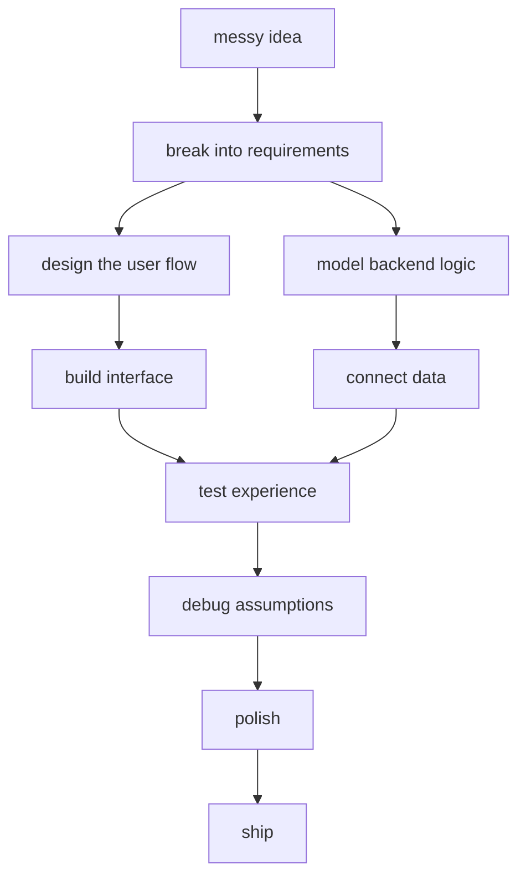

<div align="center">


<br><br>


<br>


</div>

---

```txt
╭────────────────────────────────────────────────────────────╮
│                                                            │
│                    THE HUMAN COMPILER                      │
│                                                            │
│        raw ideas  ──►  logic  ──►  design  ──►  code        │
│                                                            │
│        errors become lessons. bugs become checkpoints.     │
│        every project becomes a better version of thinking. │
│                                                            │
╰────────────────────────────────────────────────────────────╯
```

---

## 00. SYSTEM BOOT

```yaml
identity:
  role: "Computer Science Student"
  build_type: "Frontend-focused Full-Stack Developer"
  thinking_style: "algorithmic + visual + practical"

current_processes:
  - Data Structures and Algorithms
  - Full-Stack Web Development
  - DevOps and CI/CD
  - Docker + Kubernetes + Jenkins
  - System Design Fundamentals
  - Building portfolio-worthy projects

core_belief:
  "Good software should not only work. It should feel intentional."
```

---

## 01. THE EQUATION THAT RUNS HERE

<div align="center">

### `clarity(problem) + creativity(solution) = meaningful_software`

### `design ≠ decoration`
### `design = communication + usability + structure`

### `while (not_ready) { learn(); build(); debug(); repeat(); }`

</div>

---

## 02. INSIDE THE MACHINE

<table>
<tr>
<td width="50%">

### 🧠 Logic Layer

```txt
I like breaking problems into:
  → inputs
  → constraints
  → patterns
  → edge cases
  → clean solutions
```

</td>
<td width="50%">

### 🎨 Interface Layer

```txt
I care about:
  → visual hierarchy
  → smooth user flow
  → readable layouts
  → polished presentation
  → meaningful interaction
```

</td>
</tr>
<tr>
<td width="50%">

### ⚙️ Backend Layer

```txt
I build with:
  → APIs
  → authentication
  → database logic
  → structured routes
  → reliable workflows
```

</td>
<td width="50%">

### 🚀 Deployment Layer

```txt
I explore:
  → GitHub
  → Docker
  → Kubernetes
  → Jenkins
  → CI/CD pipelines
```

</td>
</tr>
</table>

---

## 03. TOOLCHAIN

<div align="center">

<table>
<tr>
<td align="center"><b>Languages</b></td>
<td align="center">


</td>
</tr>

<tr>
<td align="center"><b>Frontend</b></td>
<td align="center">


</td>
</tr>

<tr>
<td align="center"><b>Backend</b></td>
<td align="center">


</td>
</tr>

<tr>
<td align="center"><b>Data</b></td>
<td align="center">


</td>
</tr>

<tr>
<td align="center"><b>DevOps</b></td>
<td align="center">


</td>
</tr>
</table>

</div>

---

## 04. PROJECT CONSTELLATIONS

```txt
not just projects.
small systems with purpose.
```

<table>
<tr>
<td width="33%">

### 📈 TradeWise Nexus

```txt
category : full-stack simulator
theme    : stock market + portfolio
focus    : transactions, wallet, watchlist
stack    : React, Node, MongoDB
```

A paper-trading experience with live-feeling price movement, portfolio tracking, and practical trading workflows.

</td>
<td width="33%">

### 🌾 CropSight

```txt
category : machine learning
theme    : agriculture risk engine
focus    : prediction + explainability
stack    : Python, ML, SHAP
```

An explainable ML system for post-harvest spoilage risk analysis and interpretable decision support.

</td>
<td width="33%">

### 🎓 LearnSphere

```txt
category : edtech + devops
theme    : learning platform
focus    : quizzes, tracking, deployment
stack    : React, Node, Jenkins
```

A learning platform concept with dashboards, progress tracking, CI/CD flow, Docker, Kubernetes, and DevSecOps thinking.

</td>
</tr>
</table>

---

## 05. HOW IDEAS TRAVEL HERE



---

## 06. PORTFOLIO PORTAL

<div align="center">

<a href="https://vaidehi92562.github.io/vaidehi-github-profile/">
  
</a>

<br><br>

<a href="https://vaidehi92562.github.io/vaidehi-github-profile/">
  
</a>

</div>

---

## 07. SIGNALS FROM THE MACHINE

<div align="center">


<br><br>


</div>

---

## 08. BUGS I HAVE MET

```txt
[✓] typo pretending to be a logic error
[✓] missing semicolon with main-character energy
[✓] CSS behaving like it has free will
[✓] backend working until frontend asks questions
[✓] "just one small change" becoming an entire subplot
```

---

## 09. FINAL LINE

<div align="center">

```txt
systems are built twice:
first in thought,
then in code.
```


</div>
