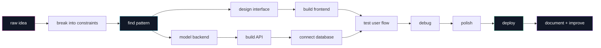

<div align="center">


<br><br>


<br>


<br><br>

<a href="https://vaidehi92562.github.io/vaidehi-github-profile/">
  
</a>

</div>

---

<div align="center">

#  The Logic Observatory 

### A developer space where ideas are decomposed, debugged, designed, and deployed.

</div>

```txt
╭────────────────────────────────────────────────────────────────────╮
│                                                                    │
│   OBSERVATION   →   ABSTRACTION   →   IMPLEMENTATION   →   IMPACT  │
│                                                                    │
│   messy idea        pattern found       system built        shipped │
│                                                                    │
╰────────────────────────────────────────────────────────────────────╯
```

---

<div align="center">

## 🧭 Navigation Console

<table>
<tr>
<td align="center"><a href="#-system-map">System Map</a></td>
<td align="center"><a href="#-current-runtime">Runtime</a></td>
<td align="center"><a href="#-equation-board">Equations</a></td>
<td align="center"><a href="#-tool-matrix">Tools</a></td>
<td align="center"><a href="#-project-lab">Projects</a></td>
<td align="center"><a href="#-portfolio-window">Portfolio</a></td>
<td align="center"><a href="#-github-signal-room">Signals</a></td>
</tr>
</table>

</div>

---

## 🗺 System Map



---

## ⚙ Current Runtime

<table>
<tr>
<td width="50%">

```yaml
runtime:
  identity: "CSE student"
  mode: "frontend-focused full-stack builder"
  engine: "logic + creativity"
  current_goal: "build polished, practical, portfolio-worthy systems"
```

</td>
<td width="50%">

```yaml
active_threads:
  - DSA in Python
  - full-stack web apps
  - REST APIs
  - databases
  - Docker and Kubernetes
  - Jenkins CI/CD
  - system design basics
```

</td>
</tr>
</table>

---

## ∑ Equation Board

<div align="center">

### `logic(problem) + creativity(solution) = meaningful_software`

### `clean_UI + reliable_API + useful_data = product_like_experience`

### `∀ bug ∈ project, ∃ lesson ∈ debugging`

### `while (learning) { build(); break(); debug(); improve(); }`

</div>

---

## 🧪 Interactive Lab Doors

<details open>
<summary><b>🚪 Door 01 — What this profile is actually about</b></summary>

<br>

```txt
This is not a static profile.
This is a small map of experiments:
  → interfaces I want to polish
  → systems I want to understand
  → algorithms I want to master
  → projects I want to make presentation-worthy
```

I like building work that has both **logic** and **presence**.  
Not just “it runs” — but “it looks intentional, explains itself, and solves something clearly.”

</details>

<details>
<summary><b>🚪 Door 02 — How I think while building</b></summary>

<br>

```txt
1. What is the actual problem?
2. What are the inputs and constraints?
3. What is the simplest useful flow?
4. What can break?
5. What should the user understand instantly?
6. What can be improved visually?
7. What can be shipped confidently?
```

</details>

<details>
<summary><b>🚪 Door 03 — My current learning quest</b></summary>

<br>

```txt
quest_01: master Python fundamentals
quest_02: move into DSA patterns
quest_03: build stronger full-stack projects
quest_04: understand CI/CD deeply
quest_05: become interview-ready
quest_06: make every project look unforgettable
```

</details>

---

## 🧰 Tool Matrix

<div align="center">

<table>
<tr>
<td align="center"><b>Layer</b></td>
<td align="center"><b>Stack</b></td>
</tr>

<tr>
<td><b>Languages</b></td>
<td>


</td>
</tr>

<tr>
<td><b>Frontend</b></td>
<td>


</td>
</tr>

<tr>
<td><b>Backend</b></td>
<td>


</td>
</tr>

<tr>
<td><b>DevOps</b></td>
<td>


</td>
</tr>
</table>

</div>

---

## 🛰 Project Lab

<table>
<tr>
<td width="33%">

### 📈 TradeWise Nexus

```txt
classification : full-stack simulator
domain         : paper trading
core loop      : funds → buy → hold → sell → track
focus          : live-feeling prices + portfolio flow
```

**Why it matters:**  
It turns stock-market learning into an interactive, hands-on simulation.

</td>
<td width="33%">

### 🌾 CropSight

```txt
classification : explainable ML
domain         : agriculture risk
core loop      : data → model → risk score → insight
focus          : prediction + explainability
```

**Why it matters:**  
It shows how ML can support post-harvest decision-making through interpretable outputs.

</td>
<td width="33%">

### 🎓 LearnSphere

```txt
classification : edtech + devops
domain         : learning platform
core loop      : learn → quiz → track → improve
focus          : CI/CD + Docker + Kubernetes
```

**Why it matters:**  
It combines learning experience with software deployment and DevOps thinking.

</td>
</tr>
</table>

---

## 🔮 Portfolio Window

<div align="center">

<a href="https://vaidehi92562.github.io/vaidehi-github-profile/">
  
</a>

<br><br>

<a href="https://vaidehi92562.github.io/vaidehi-github-profile/">
  
</a>

</div>

---

## 📡 GitHub Signal Room

<div align="center">


<br><br>


<br><br>


</div>

---

## 🧩 Mini Console

```txt
> run profile.scan()

modules_found:
  [01] algorithmic thinking
  [02] visual design sense
  [03] full-stack development
  [04] debugging patience
  [05] DevOps curiosity
  [06] project polish obsession

result:
  still learning, still building, still upgrading
```

---

## 🐞 Bug Museum

<details>
<summary><b>Open the bug museum</b></summary>

<br>

```txt
bug_001 : Spent 40 minutes debugging. File was not saved.
bug_002 : CSS centered everything except my confidence.
bug_003 : Backend worked perfectly until frontend asked a question.
bug_004 : One small change became a three-hour side quest.
bug_005 : Console.log became a therapist.
bug_006 : It worked yesterday. A classic horror story.
```

</details>

---

## 🪐 Final Transmission

<div align="center">

```txt
The goal is not to look like every developer profile.
The goal is to make the work feel alive.
```


</div>
