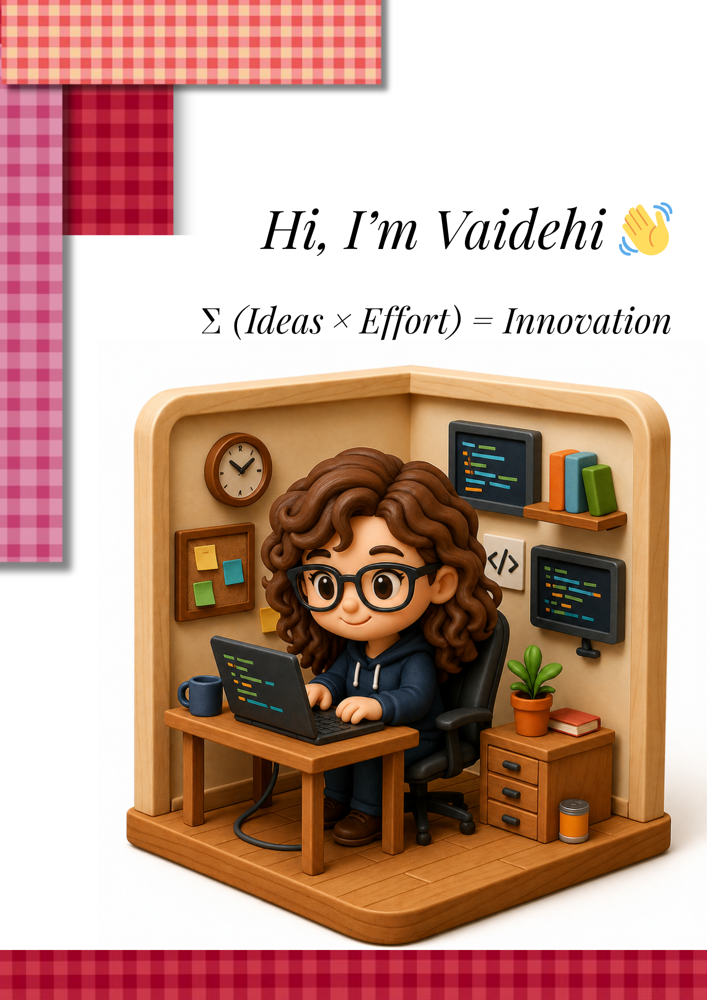
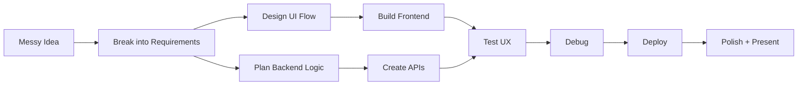
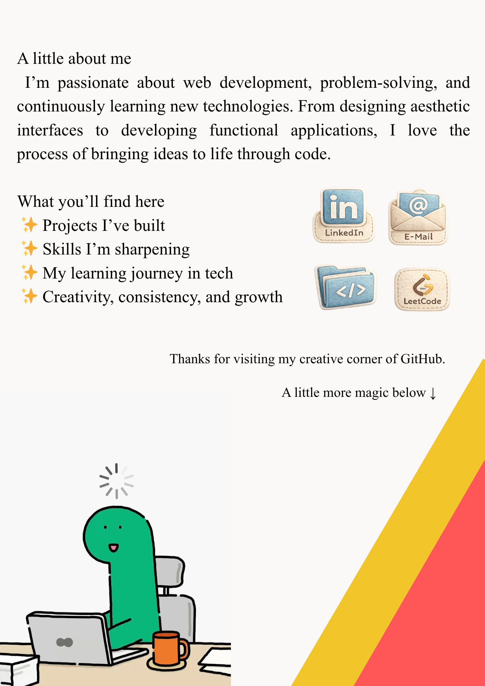

<div align="center">



<br>


<br>


</div>

---

<div align="center">

# ⌘ The Algorithmic Atelier

### A small corner of the internet where logic gets dressed up as software.

</div>

```txt
┌──────────────────────────────────────────────────────────────┐
│  input      : curiosity, chaos, coffee, constraints           │
│  transform  : think → model → code → test → refine            │
│  output     : interfaces, systems, dashboards, products       │
│  invariant  : keep learning                                  │
└──────────────────────────────────────────────────────────────┘
```

---

## ⟡ Current Operating System

<table>
<tr>
<td width="50%">

### 🧠 Kernel

```txt
role        = CSE Student
mode        = Full-Stack Builder
mindset     = logic × creativity
debug_style = patient but dramatic
```

</td>
<td width="50%">

### ⚙️ Active Processes

```txt
process_01  DSA patterns
process_02  full-stack projects
process_03  DevOps pipelines
process_04  system design basics
process_05  portfolio experiments
```

</td>
</tr>
</table>

---

## ⟡ Build Philosophy

```txt
A project should not only run.
It should explain itself.
It should look intentional.
It should feel like someone cared.
```

> I like turning basic assignment ideas into product-like experiences — clean interfaces, structured logic, useful workflows, and enough visual polish to make someone pause.

---

## ⟡ The Equation Board

<div align="center">

### `ideas + algorithms + design → useful software`

### `clean UI + reliable backend = better user experience`

### `while (confused) { learn(); build(); debug(); }`

### `∀ problem, ∃ pattern`

</div>

---

## ⟡ My Skill Constellation

<div align="center">

### Languages


<br><br>

### Web Engineering


<br><br>

### Tools & Deployment


</div>

---

## ⟡ Project Observatory

<table>
<tr>
<td width="33%">

### 📈 TradeWise Nexus

A paper-trading simulator with live-feeling prices, wallet operations, watchlist, transactions, and portfolio tracking.

```txt
type     : Full-Stack
stack    : React · Node.js · MongoDB
focus    : simulation + dashboards
```

</td>
<td width="33%">

### 🌾 CropSight

An explainable ML-based risk engine for predicting post-harvest spoilage risk and producing interpretable insights.

```txt
type     : AI/ML
stack    : Python · SHAP · ML
focus    : prediction + explainability
```

</td>
<td width="33%">

### 🎓 LearnSphere

A learning platform idea with quizzes, progress tracking, dashboards, CI/CD, Docker, Kubernetes, and DevSecOps flow.

```txt
type     : EdTech + DevOps
stack    : React · Node.js · Jenkins
focus    : learning + deployment
```

</td>
</tr>
</table>

---

## ⟡ Thought Pipeline



---

## ⟡ Portfolio Portal

<div align="center">

<a href="https://vaidehi92562.github.io/vaidehi-github-profile/">
  
</a>

<br><br>

<a href="https://vaidehi92562.github.io/vaidehi-github-profile/">
  
</a>

</div>

---

## ⟡ GitHub Signals

<div align="center">


<br><br>


</div>

---

## ⟡ Tiny Bug Museum

```txt
bug_001  Forgot a semicolon. Blamed the universe.
bug_002  Fixed one issue. Created three side quests.
bug_003  Console.log became emotional support.
bug_004  Works on my machine: the ancient spell.
bug_005  Debugged for 2 hours. It was a typo.
```

---

<div align="center">

### `commit by commit, the system becomes clearer`


</div>
