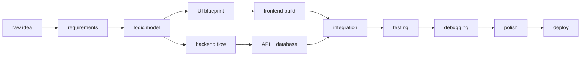

<div align="center">


<br>

#  A Proof of Work in Progress 

### Where algorithms become interfaces, bugs become lessons, and ideas compile into systems.

<br>


<br><br>

<a href="https://vaidehi92562.github.io/vaidehi-github-profile/">
  
</a>

</div>

---

## ⟡ Abstract

```txt
This repository is not just a profile.
It is a small computational notebook of experiments, systems, interfaces,
unfinished questions, solved bugs, and projects slowly becoming sharper.
```

I like building software that has both **logic** and **presence** — projects that are not only functional, but structured, readable, visually intentional, and useful enough to explain themselves.

---

## ⟡ Theorem 01: Meaningful Software

```txt
Given:
  curiosity ∈ mind
  constraints ∈ problem
  logic ∈ solution
  design ∈ communication

To prove:
  useful software can be created through repeated iteration.
```

```txt
Proof:
  observe(problem)
  decompose(problem)
  model(solution)
  build(interface)
  connect(backend)
  test(edge_cases)
  debug(assumptions)
  polish(experience)
  ship()

Therefore:
  small commits accumulate into meaningful systems.
```

<div align="right">

`Q.E.D. but still debugging.`

</div>

---

## ⟡ Current Runtime

<table>
<tr>
<td width="50%">

```yaml
system:
  type: "CSE student"
  mode: "full-stack builder"
  preference: "frontend polish + backend clarity"
  operating_style: "learn, build, break, fix, repeat"
```

</td>
<td width="50%">

```yaml
active_threads:
  - data structures and algorithms
  - full-stack web applications
  - REST APIs and databases
  - Docker, Kubernetes, Jenkins
  - CI/CD and deployment workflows
  - system design fundamentals
```

</td>
</tr>
</table>

---

## ⟡ The Workbench

<table>
<tr>
<td width="25%" align="center">

### 𝟎𝟏  
### Think

```txt
requirements
constraints
patterns
edge cases
```

</td>
<td width="25%" align="center">

### 𝟎𝟐  
### Build

```txt
interfaces
APIs
databases
workflows
```

</td>
<td width="25%" align="center">

### 𝟎𝟑  
### Debug

```txt
logs
states
flows
assumptions
```

</td>
<td width="25%" align="center">

### 𝟎𝟒  
### Polish

```txt
layout
motion
clarity
presentation
```

</td>
</tr>
</table>

---

## ⟡ A Tiny Compiler for Ideas



---

## ⟡ Tool Inventory

<table>
<tr>
<td width="20%"><b>Languages</b></td>
<td>


</td>
</tr>

<tr>
<td><b>Frontend</b></td>
<td>


</td>
</tr>

<tr>
<td><b>Backend</b></td>
<td>


</td>
</tr>

<tr>
<td><b>DevOps</b></td>
<td>


</td>
</tr>
</table>

---

## ⟡ Project Case Files

<details open>
<summary><b>📈 Case File 01: TradeWise Nexus</b></summary>

```txt
classification : full-stack simulator
domain         : stock market learning
core idea      : simulate trading without real financial risk
features       : wallet, buy/sell, watchlist, portfolio, transactions
engineering    : frontend + backend + database + containerization
```

A paper-trading system with live-feeling stock movement, wallet operations, holdings, watchlist, and transaction history.

</details>

<details>
<summary><b>🌾 Case File 02: CropSight</b></summary>

```txt
classification : explainable machine learning
domain         : agriculture and post-harvest risk
core idea      : convert storage conditions into spoilage risk insight
features       : prediction, risk score, model comparison, explainability
engineering    : preprocessing + ML + SHAP + interpretation
```

A predictive risk engine designed to support better post-harvest decision-making using machine learning and explainability.

</details>

<details>
<summary><b>🎓 Case File 03: LearnSphere</b></summary>

```txt
classification : edtech + devops
domain         : learning platform
core idea      : combine learning experience with deployment workflow
features       : courses, quizzes, progress, dashboards, CI/CD
engineering    : React + backend + Jenkins + Docker + Kubernetes
```

A learning platform concept with a strong DevOps layer, focused on deployment, automation, and product-like presentation.

</details>

---

## ⟡ Portfolio Window

<div align="center">

<a href="https://vaidehi92562.github.io/vaidehi-github-profile/">
  
</a>

<br><br>

<a href="https://vaidehi92562.github.io/vaidehi-github-profile/">
  
</a>

</div>

---

## ⟡ Debug Log

```txt
[log 001] A blank screen is not failure. It is the UI asking for meaning.
[log 002] A bug is often a misunderstanding wearing technical clothes.
[log 003] A good project is 40% code, 30% structure, 20% polish, 10% panic.
[log 004] Console logs are breadcrumbs from past confusion.
[log 005] The best feature is the one that still makes sense tomorrow.
```

---

## ⟡ GitHub Signal Panel

<div align="center">


</div>

---

## ⟡ Closing Lemma

```txt
A system becomes beautiful when:
  logic is clear,
  structure is honest,
  interface is kind,
  and the builder refuses to stop improving.
```

<div align="center">

### `commit → reflect → refactor → repeat`

</div>
